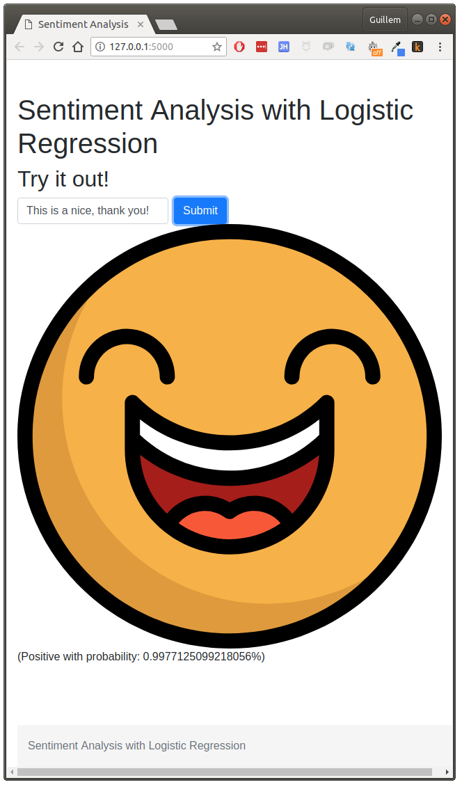

# Sentiment Analysis with Logistic Regression

This repository contains a [jupyter][jupyter] notebook and the necessary data to implement
sentiment analysis of tweets using Logistic Regression. Please open the notebook
for more information.

## The dataset
The dataset was obtained from a [Kaggle][kaggle] competition. The dataset is divided
into a train and a test dataset. Each record contains the following fields:

| Field name | Meaning |
|------------|-----------|
| ItemID  | id of twit|
| Sentiment | sentiment (1-positive, 0-negative)|
| SentimentText | text of the twit|

## Web app
You can go straight ahead and try out the algorithm with a small web app I have
included in this repository, just run:

    cd site
    python app.py

Then open a browser in the default address (`http://127.0.0.1:5000/`) and play around:

## Requirements
This notebook will run in Python >= 3.5. The following packages are required:

* bokeh
* flask
* nltk
* numpy
* pandas
* scikit-learn

## Limitations
Because the training set contains only English twits, this classifier will only
work with **English twits**.

[jupyter]: http://jupyter.org/
[kaggle]: https://www.kaggle.com/c/twitter-sentiment-analysis2
